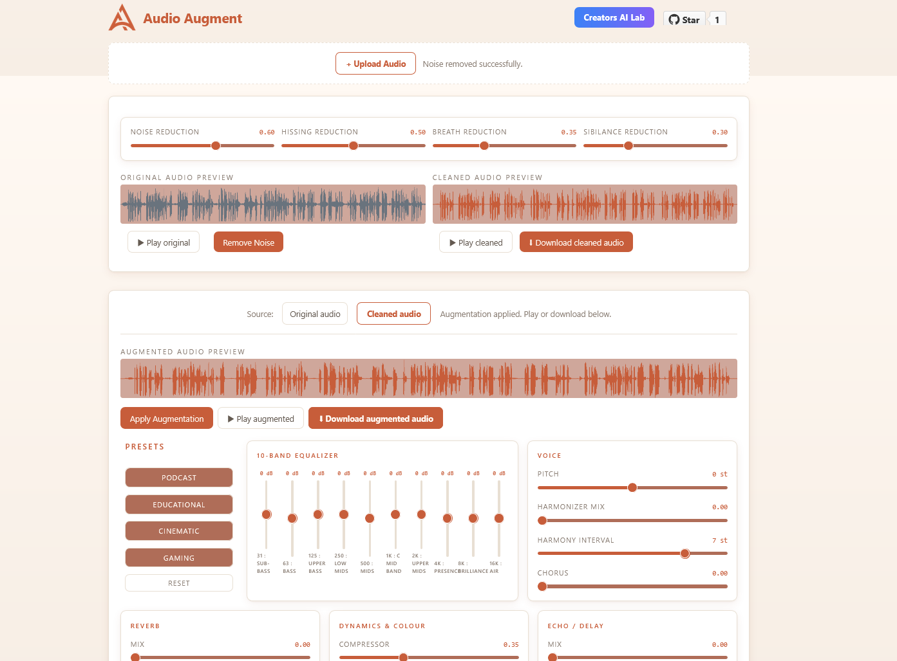

# Audio Augment Studio
_by Creators AI Lab_

A very simple and fast audio editing studio that works with great precision. It has been designed and developed for content creators to edit their audio at their fingertips without any hassle.

`no accounts`, `no internet required`, `just kickstart`

### Audio Augment Interface Screenshot:



## What it does

Drop an MP3 or WAV and professional cleaned and edite audio. It provide **_two_** independent processing stages:

**Stage 1: Noise Removal**
- Background noise reduction
- Hiss reduction
- Breath reduction
- Sibilance (de-ess) reduction

**Stage 2: Audio Augmentation**
- 3-band EQ (Low / Mid / High)
- Pitch shift
- Harmonizer
- Compressor
- Saturation
- Reverb + room size
- Delay + feedback
- Chorus
- Resonance

Built-in presets: **Podcast**, **Radio**, **Cinematic**, **Robot**

> Export as MP3 at any stage, **cleaned** audio or **augmented** audio

## Download

Grab the latest Windows installer from [Releases](../../releases).

1. Download `audio-augment-x.x.x-x64.nsis.7z`
2. Extract and run the installer
3. Launch **Audio Augment** from the desktop shortcut

> Mac and Linux builds are not yet available.

## Architecture

**Web** — TanStack Start (React + SSR) deployed on Cloudflare Workers
**Desktop** — Electron shell loading a pre-built static bundle via `file://`
**Audio engine** — 100% Web Audio API, runs in-process, no server calls
**MP3 encoding** — lamejs, runs client-side
**Styling** — Tailwind CSS v4 + Radix UI primitives


---

## Run locally (desktop app)

**Requirements:** Node.js 20+, npm

```bash
git clone https://github.com/your-username/audio-augment.git
cd audio-augment
npm install
npm run dev

# start desktop app
npm run desktop
```

```bash
# build locally
npm run desktop:package
```